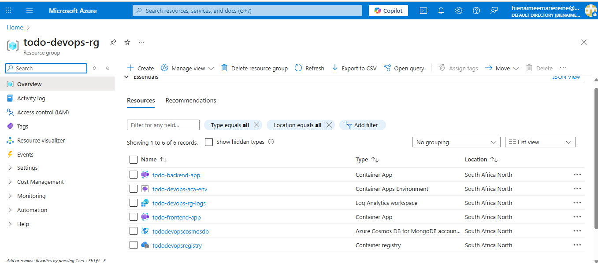
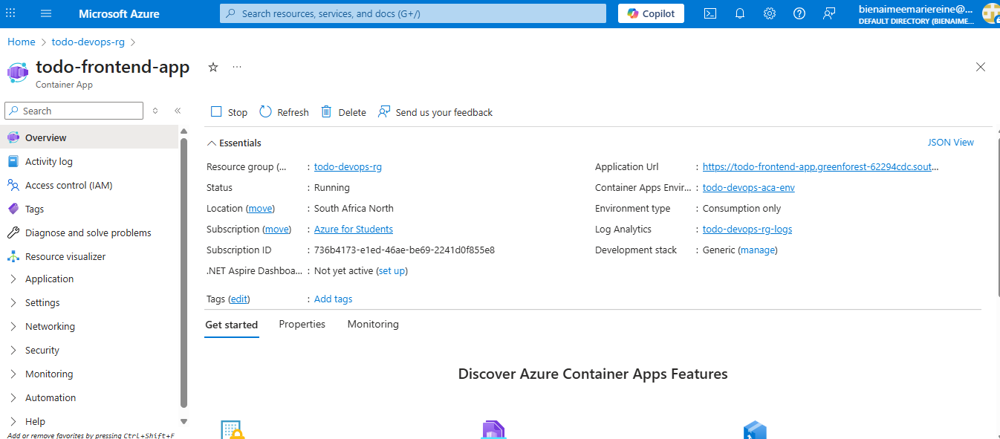
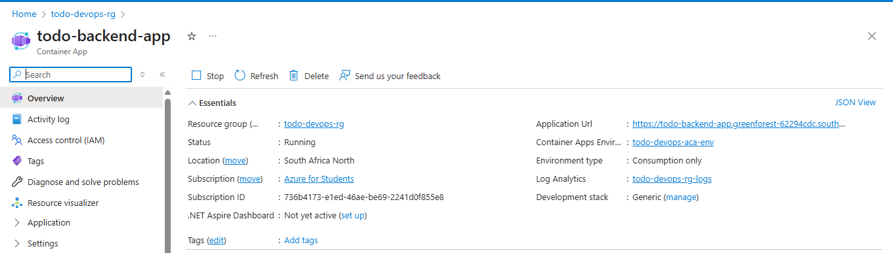

# Phase 2: IaC, Containerization & Manual Deployment Submission

## Live Public URL

[link text](https://todo-frontend-app.greenforest-62294cdc.southafricanorth.azurecontainerapps.io/)

## Screenshots of Successfully Provisioned Resource

Here are screenshots of my deployed Azure resource:

## A link to the Pull Request you reviewed for your peer

[link text](https://github.com/mbienaimee/todo-devops/pull/27)

## A brief reflection on the challenges of IaC and the manual deployment process

- **What was difficult?**
  - Getting Terraform setup and dealing with its state.
  - Azure CLI command syntax, especially with complex environment variables or line continuations (remember `\` vs `` ` `` in different shells, and the `&` issue in PowerShell).
  - Debugging Docker builds or pushes.
  - Understanding the different parts of Azure Container Apps (Environment, App, Ingress).
  - Authentication issues (like the ACR pull error).
- **What did you learn?**
  - The importance of accurate documentation and careful copying/pasting.
  - How powerful IaC (Terraform) is for managing cloud resources.
  - The benefits of containerization (consistent environments).
  - How multi-stage Docker builds help.
